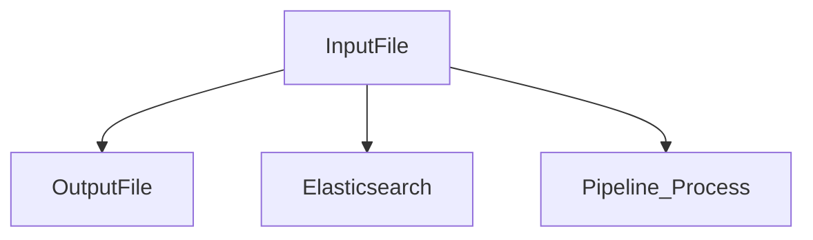

# Работа с ELK

[[_TOC_]]

## Logstash
  После создания и настрйки пайплайнов для _logstash_ перезагружаем его с помощью `sudo systemctl restart logstash.service` для применения новой конфигурации. Используем следующую команду для проверки новых настроек пайплайнов:
 ```bash
 http GET :9600/_node/stats/pipeline
 ```
 Запрос возвращает документ JSON, содержащий статистику конвейера, в том числе[^1]:

- количество событий, которые были введены, отфильтрованы или выведены каждым конвейером
- статистика для каждого настроенного фильтра _(filters: mutate,grok)_ или выходного каскада _(outputs: pipeline, file)_
- сведения об успехах и сбоях перезагрузки конфигурации (если включена перезагрузка конфигурации)
- сведения о постоянной очереди (если постоянные очереди включены)

<details><summary>Пример вывода</summary>

```http
HTTP/1.1 200 OK
Content-Length: 5829
Content-Type: application/json
X-Content-Type-Options: nosniff

{
    "ephemeral_id": "964ff6de-2aff-4cec-9a2a-e6e3a5cb0c55",
    "host": "logstash",
    "http_address": "127.0.0.1:9600",
    "id": "a10f6de6-b745-4526-b77c-03c9fef3c78b",
    "name": "logstash",
    "pipeline": {
        "batch_delay": 50,
        "batch_size": 125,
        "workers": 2
    },
    "pipelines": {
        "input": {
            "ephemeral_id": "241b65fa-0fe7-41ab-a4b0-d9c705a1f645",
            "events": {
                "duration_in_millis": 109,
                "filtered": 11,
                "in": 11,
                "out": 11,
                "queue_push_duration_in_millis": 0
            },
            "hash": "83e29de411454ede29b054c301fac56410dfa9cc8634a3923db417e315542078",
            "plugins": {
                "codecs": [
                    {
                        "decode": {
                            "duration_in_millis": 0,
                            "out": 0,
                            "writes_in": 0
                        },
                        "encode": {
                            "duration_in_millis": 0,
                            "writes_in": 0
                        },
                        "id": "plain_2292b05e-e21d-4299-9b4c-7a3bbb7c9a92",
                        "name": "plain"
                    },
                    {
                        "decode": {
                            "duration_in_millis": 0,
                            "out": 0,
                            "writes_in": 0
                        },
                        "encode": {
                            "duration_in_millis": 24,
                            "writes_in": 11
                        },
                        "id": "json_lines_3ddc117d-2e57-4efe-a927-bbbb68cabc03",
                        "name": "json_lines"
                    },
                    {
                        "decode": {
                            "duration_in_millis": 0,
                            "out": 0,
                            "writes_in": 0
                        },
                        "encode": {
                            "duration_in_millis": 0,
                            "writes_in": 0
                        },
                        "id": "plain_4fafeae8-1800-4716-806c-e2ed53fa311d",
                        "name": "plain"
                    }
                ],
                "filters": [
                    {
                        "events": {
                            "duration_in_millis": 7,
                            "in": 11,
                            "out": 11
                        },
                        "id": "8e7019d4fd7cd42b6c2b2b873f8dded277e14ce4909dffd2d2cfd64612da0ff4",
                        "matches": 11,
                        "name": "date"
                    },
                    {
                        "events": {
                            "duration_in_millis": 28,
                            "in": 11,
                            "out": 11
                        },
                        "failures": 0,
                        "id": "c17a9e604b899a9408a140a66f43901b54a3e29a13da416de1fc3aa7def01813",
                        "matches": 11,
                        "name": "grok",
                        "patterns_per_field": {
                            "message": 5
                        }
                    },
                    {
                        "events": {
                            "duration_in_millis": 0,
                            "in": 0,
                            "out": 0
                        },
                        "id": "16e0ff66881fdb37b4704fadc667db82453b0e4b8d2f8380741e12556da1c968",
                        "name": "bytes"
                    },
                    {
                        "events": {
                            "duration_in_millis": 5,
                            "in": 11,
                            "out": 11
                        },
                        "id": "2197983a85d78d801873fab82d7643ab83878120e071fdf1a249990f23f667bd",
                        "name": "mutate"
                    },
                    {
                        "events": {
                            "duration_in_millis": 0,
                            "in": 0,
                            "out": 0
                        },
                        "id": "d1588a5db80cb39254e7ac47069553b37ff1eabc5973a7259679686c5318b971",
                        "name": "mutate"
                    }
                ],
                "inputs": [
                    {
                        "events": {
                            "out": 11,
                            "queue_push_duration_in_millis": 0
                        },
                        "id": "925a06e8d4b037c3a74f53948f77c1bee9d85b4e494ed32dfb87c5c26acc43ee",
                        "name": "file"
                    }
                ],
                "outputs": [
                    {
                        "events": {
                            "duration_in_millis": 46,
                            "in": 11,
                            "out": 11
                        },
                        "id": "1f9c2d1e9e5d29bccadb3cf2f04533f941cc6147a6070a22ef083238bd722ac2",
                        "name": "file"
                    },
                    {
                        "events": {
                            "duration_in_millis": 10,
                            "in": 11,
                            "out": 11
                        },
                        "id": "4b6d1825363d4a7f0b08f3d8935ed8e3dd91a34a42cb50f338ea39793e18eb5d",
                        "name": "pipeline",
                        "send_to": [
                            "pipeline_process"
                        ]
                    },
                    {
                        "events": {
                            "duration_in_millis": 2,
                            "in": 0,
                            "out": 0
                        },
                        "id": "c6d3be2f094e31a3a77b9f9943772247a0d185991be830c1ce5575e5d16c291b",
                        "name": "elasticsearch"
                    },
                ]
            },
            "queue": {
                "events_count": 0,
                "max_queue_size_in_bytes": 0,
                "queue_size_in_bytes": 0,
                "type": "memory"
            },
            "reloads": {
                "failures": 0,
                "last_error": null,
                "last_failure_timestamp": null,
                "last_success_timestamp": null,
                "successes": 0
            }
        }
    },
    "snapshot": false,
    "status": "green",
    "version": "8.1.1"
}
```
</details>
:zap: :zap: :zap: Таким образом можно проверить что все новые настроки применились. Видно три

Here is a simple flow chart:


## Elasticsearch


В _Elasticsearch_  используется специальный инструмент ILM:index lifecycle management, он позволяет[^2]:

1. Развертываит новоый индекс, когда он достигает определенного размера или количества документов
2. Создавайть новый индекс каждый день, неделю или месяц и архивировать предыдущие
3. Удалять устаревшие индексы для обеспечения соблюдения стандартов хранения данных

Для заведения в _elasticsearch_ нового 


| header | header |
| ------ | ------ |
| cell | cell |
| cell | cell |

[^1]: https://www.elastic.co/guide/en/logstash/7.6/node-stats-api.html
[^2]: https://www.elastic.co/guide/en/elasticsearch/reference/7.6/index-lifecycle-management.html
